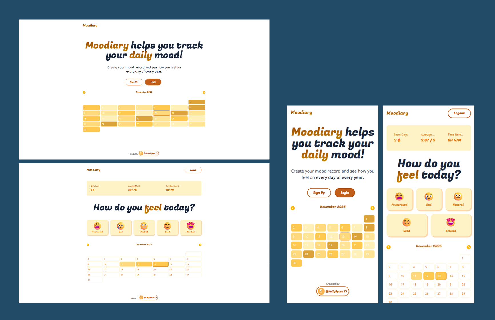

# Moodiary | Mood Tracker App [🔗](https://kb-moodiary.netlify.app "Click to launch the Moodiary")

### Screenshots

---

## 💡 Overview

**Moodiary** is a simple and intuitive daily mood-tracking application built with **React**, **Next.js 14**, **Tailwind CSS**, and **Firebase**. After authenticating, users can select one of five mood icons to record how they feel each day. The app visualizes mood history on a monthly calendar and provides key insights such as streaks and average mood.

 

## 🚀 Key Features

- **User Authentication**
  Secure sign-in and sign-out flow using Firebase Authentication.
- **Daily Mood Logging**
  Users choose from five mood levels (1–5). The day’s mood is saved to Firestore.
- **Color-Coded Monthly Calendar**
  Each calendar cell displays a color representing the saved mood for that date.
- **Statistics Dashboard**
  - Current mood streak
  - Average mood for the selected month or overall
- **Real-Time Sync**
  UI updates immediately when new mood data is recorded.

 

## 🛠 Tech Stack / Skills Demonstrated

- **Next.js 14 (App Router)**
  Server components, route handlers, file-based routing.
- **React**
  State management with hooks, component composition.
- **Tailwind CSS**
  Responsive design, utility-first styling.
- **Firebase Authentication**
  Auth state handling, protected routes.
- **Firestore (NoSQL database)**
  CRUD operations, real-time updates, data modeling.
- **Deployment & Environment Config**
  Secure API key handling (.env files), deployed with Netlify.

 

## 🧩 What I Learned

- Implementing a **full authentication workflow** with Firebase Auth (sign-in, sign-out, session listening).
- Designing and structuring a **NoSQL Firestore schema** for time-based data.
- Building a **dynamic calendar UI** and mapping Firestore data to date-based components.
- Calculating statistics such as streaks and averages based on user-generated data.
- Applying **responsive and accessible UI design** using Tailwind CSS.
- Managing **client/server boundaries** in Next.js 14 and optimizing rendering patterns.
- Debugging asynchronous Firestore reads/writes and ensuring real-time UI consistency.

 

## 🎯 Future Improvements

- **Mood Notes**
  Allow users to add a short note or journal entry along with their daily mood.
- **Edit Past Entries**
  Provide tools to view and update previously recorded moods.
- **Dark Mode**
  Add theme switching for improved accessibility and user preference.
- **Advanced Analytics**
  Weekly/monthly charts, mood distribution, and insights.
- **Social Features**
  Optional sharing or exporting mood data.

 

---

[🔼 Back to Top](#moodiary--mood-tracker-app-)